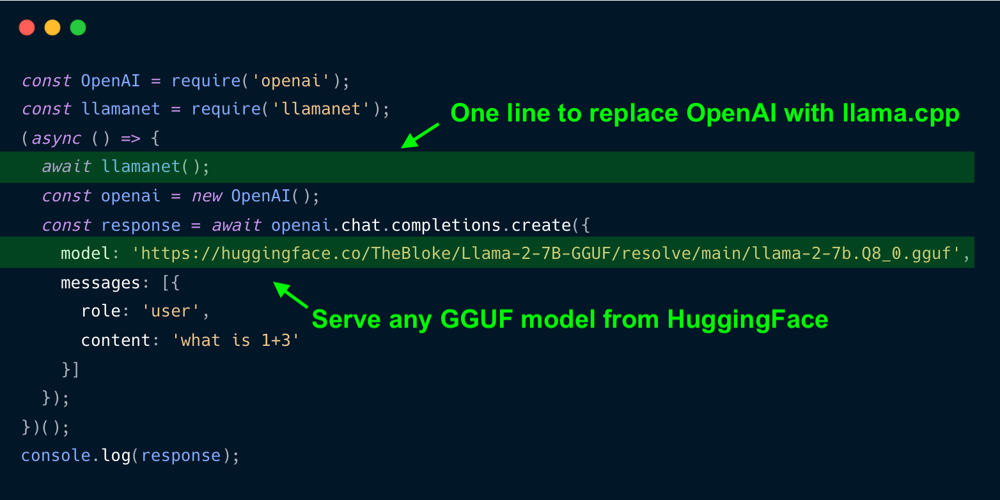
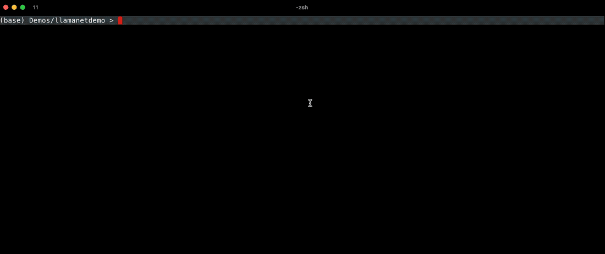

# Llamanet




- Want to instantly port an OpenAI API based LLM app to use local LLMs?
- Don't want to ask your users to download a 3rd party LLM app or server just to use your app?
- Want your app to take care of all the LLM management on its own, without relying on 3rd party systems?

**Meet Llamanet.**

**Llamanet is an embeddable llama.cpp management system that "just works", automagically.** It lets you instantly replace OpenAI with one line of code in your app. Because the engine is embedded in your app, you don't need to tell your users to install a 3rd party LLM app or server just to use your app.


1. **Ship your app without 3rd party LLMs:** Llamanet is a self-contained library/cli tool that comes with everything you need to serve LLM, natively from your app. No need to download a 3rd party LLM app/server. Your app users only need to install your app. It just works.
2. **OpenAI API Compatible Server:** Llamanet is a proxy server that can run and route to multiple [Llama.cpp servers](https://github.com/ggerganov/llama.cpp/tree/master/examples/server#llamacpp-http-server), which is [OpenAI API Compatible](https://platform.openai.com/docs/api-reference/chat). This compatibility means you can turn ANY existing OpenAI API powered app into Llama.cpp powered app, with just one line.
3. **Automagical Model Management System:** The built-in model management system gets rid of the need to separately and manually download checkpoints. Just make an OpenAI compatible API request with ANY GGUF URL on Huggingface. Instead of specifying `"model": "gpt-4-turbo"`, you specify a huggingface url (for example: `"model": "https://huggingface.co/microsoft/Phi-3-mini-4k-instruct-gguf/resolve/main/Phi-3-mini-4k-instruct-fp16.gguf"`) and should automatically download the checkpoint and launch an embedded llama.cpp server with the checkpoint, after which the request will be routed to the server.

Here's llamanet in action:


Note that it downloads llamacpp and the models on the fly the first time it's run.

---

# Community

## GitHub

https://github.com/pinokiocomputer/llamanet

## X

https://x.com/cocktailpeanut

---

# Quickstart

## 1. Terminal

Let's try the fastest way to get going. Start the llamanet server:

```
npx llamanet@latest on
```

Then open another terminal and run a curl command:

```
curl --request POST \
     --url http://127.0.0.1:42424/v1/chat/completions \
     --header "Content-Type: application/json" \
     --data '{
       "model": "https://huggingface.co/microsoft/Phi-3-mini-4k-instruct-gguf/resolve/main/Phi-3-mini-4k-instruct-q4.gguf",
       "messages": [
         { "role": "system", "content": "You are a helpful assistant." },
         { "role": "user", "content": "Hello!" }
       ]
     }'
```

Here's the full process:


## 2. Using OpenAI Package

Let's first start by using the `openai` npm package. First install `llamanet` and `openai`:

```
npm install llamanet openai
```

Then create a file named `index.js`:

```javascript
// 1. Require llamanet
const llamanet = require("llamanet");
const OpenAI = require('openai');
(async () => {
  // 2. Start llamanet
  await llamanet()
  const openai = new OpenAI()
  const stream = await openai.chat.completions.create({
    // 3. Specify the Huggingface URL of any GGUF model
    model: "https://huggingface.co/microsoft/Phi-3-mini-4k-instruct-gguf/resolve/main/Phi-3-mini-4k-instruct-fp16.gguf",
    messages: [{
      role: 'user',
      content: "what comes after 1 2 3 5 8? give me as many variations as possible with reasons"
    }],
    stream: true,
  });
  for await (const chunk of stream) {
    process.stdout.write(chunk.choices[0]?.delta?.content || '');
  }
})();
```

And run it:

```
node index
```

When you run it for the first time, it will download llamacpp and the requested model before making the request:




If you try running the same code again, it will not require the downloads therefore the request will go through immediately:


## 3. Without OpenAI Package

The `openai` package is simply an HTTP client that makes HTTP requests in certain format. Let's try WITHOUT using the `openai` package and directly make `fetch` requests:

```javascript
const llamanet = require("llamanet");
const url = 'http://127.0.0.1:42424/v1/chat/completions';
(async () => {
  await llamanet();
  const result = await fetch(url, {
    method: "post",
    headers: {
      "Content-Type": "application/json"
    },
    body: JSON.stringify({
      model: "https://huggingface.co/microsoft/Phi-3-mini-4k-instruct-gguf/resolve/main/Phi-3-mini-4k-instruct-fp16.gguf",
      messages: [
        { role: "system", content: "You are a helpful assistant." },
        { role: "user", content: "Hello!" }
      ]
    })
  }).then((res) => {
    return res.json()
  });
  console.log(JSON.stringify(result, null, 2));
})();
```

---

# Usage

## 1. Node.js API

### Basic

```javascript
const llamanet = require('llamanet');
await llamanet();
```

### Advanced

You can pass commands to the `await llamanet()` call to run commands:


```javascript
await llamanet(YARGS_PARSED_OBJECT)
```

The `YARGS_PARSED_OBJECT` params needs to follow the yargs parsed object syntax, which can be turned into terminal commands with [yargs-unparser](https://github.com/yargs/yargs-unparser)

For example:

```javascript
awati llamanet({
  _: [
    "start",
    "https://huggingface.co/bartowski/Phi-3-medium-128k-instruct-GGUF/resolve/main/Phi-3-medium-128k-instruct-IQ2_M.gguf?download=true"
  ],
  c: 128000,
  verbose: true
})
```

Above call is equivalent to running:

```
npx llamanet start https://huggingface.co/bartowski/Phi-3-medium-128k-instruct-GGUF/resolve/main/Phi-3-medium-128k-instruct-IQ2_M.gguf?download=true -c 128000 --verbose
```

Which starts a llama.cpp server with the model from `https://huggingface.co/bartowski/Phi-3-medium-128k-instruct-GGUF/resolve/main/Phi-3-medium-128k-instruct-IQ2_M.gguf?download=true`


## 2. CLI API

If you want to use llamanet with non-node.js apps, you can also do so easily by using the CLI commands:

### Step 1. Start llamanet

```
npx llamanet start
```

This will start llamanet locally.

### Step 2. Run your app

windows

```
set OPENAI_BASE_URL=http://localhost:42424/v1
set OPENAI_API_KEY=llamanet
<YOUR COMMAND HERE>
```

linux/mac:

```
export OPENAI_BASE_URL=http://localhost:42424/v1
export OPENAI_API_KEY=llamanet
<YOUR COMMAND HERE>
```

For example:

```
export OPENAI_BASE_URL=http://localhost:42424/v1
export OPENAI_API_KEY=llamanet
python app.py
```

This will run `app.py`, and if the `app.py` is powered by OpenAI, all requests will be routed to the locally running llamanet we started in step 1.

---

# API

The simplest way to integrate Llamanet into your app is to use the npm package.

But you can also use terminal commands, which also means you can integrate into any programming language simply by spawning a process with the commands.

## 1. on

start a llamanet server if it's not already running. This will start the llamanet daemon, which acts as a proxy and a management system for starting/stopping/routing incoming requests to llama.cpp servers.

> llamanet server is NOT llama.cpp server.
>
> llamanet is a management server that automatically launches and routes one or more llama.cpp servers

### CLI

```
npx llamanet on
```

### Node.js

```javascript
const llamanet = require('llamanet');
await llamanet({
  _: ["on"]
})
```

## 2. off

Turn off the llamanet server.

### CLI

```
npx llamanet off
```

### Node.js

```javascript
const llamanet = require('llamanet');
await llamanet({
  _: ["off"]
})
```

## 3. start

start a llama.cpp server for any GGUF model by specifying a huggingface url. If llamanet is not already running, launch llamanet first.


### CLI

```
npx llamanet start <HUGGINGFACE_URL>
```

Custom llama.cpp launch

```
npx llamanet start <HUGGINGFACE_URL> -c 128000 --verbose
```

### Node.js

```javascript
const llamanet = require('llamanet');
await llamanet({
  _: [ "start", <HUGGINGFACE_URL> ],
  c: 128000
  verbose: true
})
```


## 4. stop

stop a llama.cpp server if it's running

### CLI

Stop a specific llama.cpp endpoint:

```
npx llamanet stop <HUGGINGFACE_URL>
```

stop all endpoints:

```
npx llamanet stop
```

### Node.js

Stop a specific llama.cpp endpoint:

```javascript
const llamanet = require('llamanet');
await llamanet({
  _: [ "stop", <HUGGINGFACE_URL> ],
})
```

Stop all endpoints:

```javascript
const llamanet = require('llamanet');
await llamanet({
  _: [ "stop" ]
})
```

## 5. status

### CLI

print status

```
npx llamanet status
```

### Node.js

```javascript
const llamanet = require('llamanet');
await llamanet({
  _: [ "status" ]
})
```

## 6. models

display models

### CLI

```
npx llamanet models
```

### Node.js

```javascript
const llamanet = require('llamanet');
const models = await llamanet({
  _: [ "models" ]
})
```

---

# How it works

Here's what happens when you run `await llamanet()`:

1. Downloads `llamacpp` prebuilt binaries to `~/llamanet` if it doesn't already exist.
2. Starts a llamanet proxy server at port 42424 if it's not already running
3. Sets the `OPENAI_BASE_URL` environment variable to http://localhost:42424/v1 so you don't have to manually change the `baseUrl` attribute for OpenAI clients.

You don't have to change ANYTHING in your existing OpenAI powered code, because the `OPENAI_BASE_URL` is already set to `http://localhost:42424/v1` so all requests will be routed to the llamanet proxy, which will spawn and route requests to the embedded llama.cpp servers.

Let's take a look at an example:

```javascript
const response = await openai.chat.completions.create({
	model: "https://huggingface.co/microsoft/Phi-3-mini-4k-instruct-gguf/resolve/main/Phi-3-mini-4k-instruct-fp16.gguf",
	messages: [{ role: 'user', content: 'what is 1+3' }],
});
```

When you make the request,

1. If the model `https://huggingface.co/microsoft/Phi-3-mini-4k-instruct-gguf/resolve/main/Phi-3-mini-4k-instruct-fp16.gguf` has not been downloaded, it downloads the model to the `~/llamanet` folder.
2. Then llamanet checks if the llamacpp server for the model is already running. If not already running, it first starts a llama.cpp server for the model.
3. Then routes the request to the llamacpp server.

---

# Customization

You can customize the behavior of Llamanet with environment variables.

- `LLAMANET_PATH`: Where to store everything. (Default: `~/llamanet`)
- `LLAMANET_DEFAULT_MODEL`: Every API request contains a `model` attribute (example: https://huggingface.co/NousResearch/Hermes-2-Pro-Llama-3-8B-GGUF/resolve/main/Hermes-2-Pro-Llama-3-8B-F16.gguf). If the specified model url fails to download, the `LLAMANET_DEFAULT_MODEL` environment variable will be used to decide the default model to load from (The default is https://huggingface.co/microsoft/Phi-3-mini-4k-instruct-gguf/resolve/main/Phi-3-mini-4k-instruct-fp16.gguf)
- `LLAMANET_OFFLINE`: Ensure everything runs offline. Setting `LLAMANET_OFFLINE` to `true` has the effect of disabling remote HTTP requests (such as downloading checkpoints from huggingface, downloading the llama.cpp binaries, etc.)
